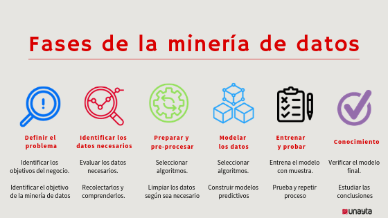
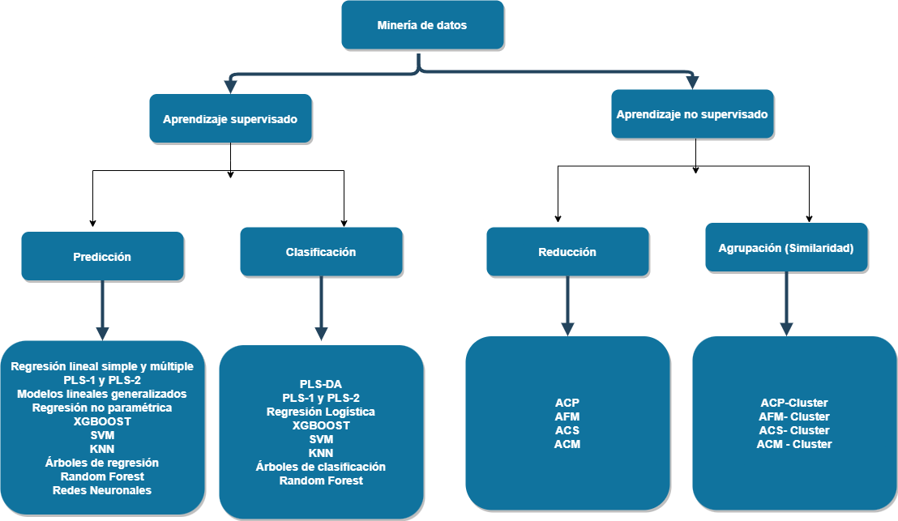
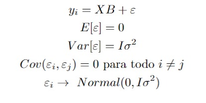
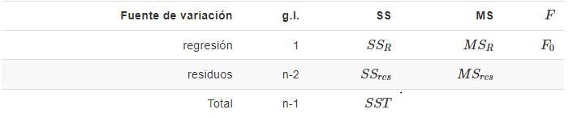

```{r setup, include=FALSE}
options(htmltools.dir.version = FALSE)
knitr::opts_chunk$set(
  fig.width=9, fig.height=3.5, fig.retina=3,
  out.width = "100%",
  cache = FALSE,
  echo = TRUE,
  message = FALSE, 
  warning = FALSE,
  hiline = TRUE
)


```


```{r xaringan-themer, include=FALSE, warning=FALSE}
options(digits = 3)
library(xaringanthemer)
style_duo_accent(
  primary_color = "black",        # gris ??   
  secondary_color = "#6FABD0",      # amarillo
  inverse_header_color = "#D7F0E9"  # blanco
)
```

class: inverse, center, middle
background-image: url(img/plantilla1.png)  /* Reemplaza "path_to_image.png" con la ruta de tu imagen de fondo */
background-size: 100% 100%
background-position: center


# Introdución a la Regresión Lineal Simple y Múltiple con R
# Andrés Felipe Palomino
## Centro de Estudios de Estadística: Sigma
## Escuela de Estadístíca -  Universidad del Valle
---
class: middle
background-image: url(img/plantilla4.png)
background-size: cover
```{r, echo=FALSE, out.width = "1000px", out.height="600px",fig.align='center'}

```
---
class: middle
background-image: url(img/plantilla4.png)
background-size: cover

```{r, echo=FALSE, out.width = "1000px", out.height="600px",fig.align='center'}

```
---
class: middle
background-image: url(img/plantilla4.png)
background-size: cover
```{r, echo=FALSE, out.width = "1000px", out.height="600px",fig.align='center'}
knitr::include_graphics("img/dato3.png.jpg")
```
---
class: middle
background-image: url(img/plantilla4.png)
background-size: cover
```{r, echo=FALSE, out.width = "1000px", out.height="600px",fig.align='center'}

```
---
class: middle
background-image: url(img/plantilla4.png)
background-size: cover
```{r, echo=FALSE, out.width = "1000px", out.height="600px",fig.align='center'}

```
---
class: middle
background-image: url(img/plantilla4.png)
background-size: cover
```{r, echo=FALSE, out.width = "1000px", out.height="600px",fig.align='center'}

```
---
class: middle
background-image: url(img/plantilla4.png)
background-size: cover
#Regresión Lineal:
La regresión lineal es una técnica de análisis de datos que predice el valor de datos desconocidos mediante el uso de otro valor de datos relacionado y conocido.<div>
Modela matemáticamente la variable desconocida o dependiente y la variable conocida o independiente como una ecuación lineal. Por ejemplo, supongamos que tiene datos sobre sus gastos e ingresos del año pasado. Las técnicas de regresión lineal analizan estos datos y determinan que tus gastos son la mitad de tus ingresos. Luego calculan un gasto futuro desconocido al reducir a la mitad un ingreso conocido 
---
class: middle
background-image: url(img/plantilla4.png)
background-size: cover

```{r, echo=FALSE,warning=FALSE,echo=FALSE}
library(patchwork);library(ggplot2)
x<-1:100
y<- 2+ 2*x+rnorm(100,0,20)
y2<- 2-2*x+rnorm(100,0,40)
y3<- 2-2*x+rnorm(100,0,100)
par(mfrow=c(1,3))
plot(y~x,pch=19,main="",xlab="",ylab="")
plot(y2~x,pch=19,main="",xlab="",ylab="")
plot(y3~x,pch=19,main="",xlab="",ylab="")
```
---
class: middle
background-image: url(img/plantilla4.png)
background-size: cover
## ¿Cómo medir esta dependencia?
A través del uso de la correlación la cual se refiere a la relación entre dos variables y cómo se mueven juntas. Se utiliza para medir la fuerza y la dirección de la relación entre estas variables.
###Correlación lineal:
La correlación lineal es un tipo específico de correlación que mide la relación lineal entre dos variables. Se evalúa mediante el coeficiente de correlación de Pearson, que oscila entre -1 y 1, donde 1 indica una correlación positiva perfecta, -1 indica una correlación negativa perfecta y 0 indica ausencia de correlación lineal.
###Correlación de Spearman:
Es un tipo de correlación no paramétrica que evalúa la relación entre dos variables utilizando el grado de relación monotónica entre ellas, es decir, si al aumentar una variable, la otra también tiende a aumentar (o disminuir) de manera constante. Spearman utiliza el coeficiente de correlación de rango para medir esta relación.
---
class: middle
background-image: url(img/plantilla4.png)
background-size: cover
###Correlación de Kendall
Al igual que la correlación de Spearman, la correlación de Kendall es no paramétrica y evalúa la fuerza de asociación entre dos variables. Se basa en la concordancia o discordancia del orden de los pares de datos entre las variables, sin depender de la escala de medida. Utiliza el coeficiente de correlación tau de Kendall para medir esta relación.
####Nota:  Es importante entender que, si bien la correlación y un diagrama de dispersión puede mostrar una asociación entre variables, no implica necesariamente una relación causal directa.
---
class: middle
background-image: url(img/plantilla4.png)
background-size: cover
```{r, echo=FALSE,warning=FALSE,echo=FALSE}
library(patchwork);library(ggplot2)
x<-1:100
y<- 2+ 2*x+rnorm(100,0,20)
y2<- 2-2*x+rnorm(100,0,40)
y3<- 2-2*x+rnorm(100,0,100)
par(mfrow=c(1,3))
plot(y~x,pch=19,main="",xlab="Número de Télefono",ylab="Ingreso per cápita de una persona")
plot(y2~x,pch=19,main="",xlab="Estatura",ylab="Peso")
plot(y3~x,pch=19,main="",xlab="Número de Cédula",ylab="Ingresos")
```

---
class: middle
background-image: url(img/plantilla4.png)
background-size: cover
```{r, echo=FALSE, out.width = "800px", out.height="500px",fig.align='center'}

```
---
class: middle
background-image: url(img/plantilla4.png)
background-size: cover
```{r, echo=FALSE, out.width = "800px", out.height="500px",fig.align='center'}

```
---
class: middle
background-image: url(img/plantilla4.png)
background-size: cover
```{r, echo=FALSE, out.width = "800px", out.height="500px",fig.align='center'}

```